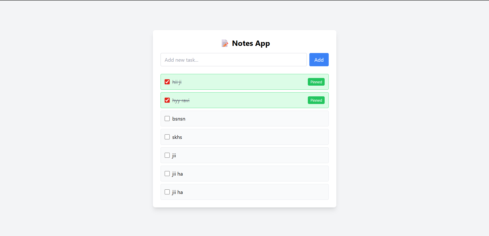

# 📝 Notes App (Node.js + Express + MongoDB + EJS)

A simple Notes application built using **Node.js, Express, MongoDB (Mongoose), and EJS**.  
Users can create notes and pin/unpin them. Pinned notes always appear at the top.

---


## 🚀 Features

- ➕ Add new notes  
- 📌 Pin / Unpin notes  
- 📊 Pinned notes appear at the top  
- 🎨 Clean UI using Tailwind CSS  
- ⚡ Server-side rendering with EJS  

---

## 🛠️ Tech Stack

- **Backend:** Node.js, Express  
- **Database:** MongoDB (Mongoose)  
- **Frontend:** EJS + Tailwind CSS  

---

## 📁 Project Structure
```js
project/
│
├── models/
│ └── NoteModel.js
│
├── controllers/
│ └── noteController.js
│
├── routes/
│ └── noteRoutes.js
│
├── views/
│ └── index.ejs
│
├── app.js
└── package.json
```
## ⚙️ Installation & Setup

### 1. Clone the repo
```bash
git clone https://github.com/your-username/notes-app.git
cd notes-app


## 🧑‍💻 Author

> Ravi Mishra